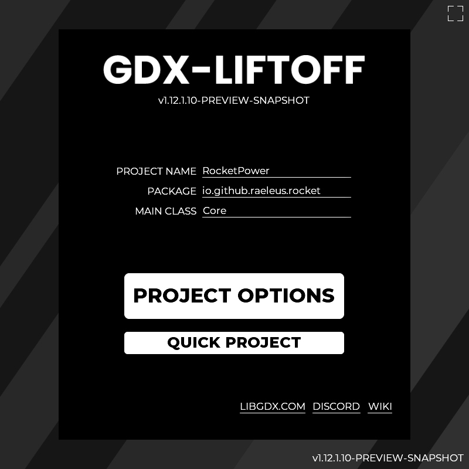

# gdx-liftoff

A setup tool for [libGDX](https://libgdx.com/) Gradle projects.



<p align="center" style="font-size: 30px;">
    <a href="https://github.com/tommyettinger/gdx-liftoff/releases">DOWNLOAD</a>
</p>

To generate a project, download the latest application `jar` and execute it, or run the following command:

```shell
java -jar gdx-liftoff-VERSION.jar
```

## Features

In addition to most official `gdx-setup` features, `gdx-liffoff` offers:
 
- **Project templates.** You can choose one of many project skeletons highlighting various libGDX features.
- **Input validation.** Your project data is validated as you type it in.
- **Other JVM languages support.** You can choose additional languages for your project, like Kotlin or Scala,
Their standard libraries, Gradle plugins, and appropriate source folders will be included.
- **Assets folder** is now in the root directory and is properly linked by all projects. No more missing resources for
the desktop project.
- **Customization.** You have more control over the versions of software used by your application.
- **More third-party extensions.** Their versions are fetched from Maven Central or JitPack, so your project is always 
up-to-date.
- **Preferences support.** Basic data of your application is saved, so you don't have to fill it each time
you generate a project.
- **Optional Gradle wrapper**. You can optionally run Gradle tasks after project generation. 

What's more, there are no major *structural differences* between any generated projects, regardless of the platforms
you initially used. The official `gdx-setup` puts assets in the `android` module, or the `core` module if Android is
not selected. If you don't start with the Android platform, adding it to an existing project would require modification
of the Gradle scripts. To avoid this issue, `gdx-liftoff` puts `assets` in the root folder. Adding a new platform
to an existing application never forces you to modify any of the other modules.

### Guide

For more details on how to use the application and how it works, see the [usage guide](Guide.md).
If you would like to contribute to the project, you might find the [architecture document](Architecture.md)
helpful.

### Credits

The project was forked from the [`czyzby/gdx-setup`](https://github.com/czyzby/gdx-setup) repository.
[@czyzby](https://github.com/czyzby) and [@kotcrab](https://github.com/kotcrab) have created the original application,
as well as a set of libraries that it depends on (`gdx-lml` and VisUI respectively). Since then, the project is
maintained by [@tommyettinger](https://github.com/tommyettinger).

Raymond Buckley has created the
[Particle Park skin for scene2d.ui](https://ray3k.wordpress.com/particle-park-ui-skin-for-scene2d-ui/),
which was adapted to be the default skin added to new projects (if the _"Generate UI Assets"_ option is selected).
"Accademia di Belle Arti di Urbino and students of MA course of Visual design" has created the _Titillium Web_
font that the skin uses (under SIL OFL license).

Other project contributors include [Mr00Anderson](https://github.com/Mr00Anderson), [lyze237](https://github.com/lyze237),
[metaphore](https://github.com/metaphore), and [payne911](https://github.com/payne911). And of course, many thanks go
to all the early adopters for putting up with any partially-working releases early on!

---

Good luck, and we hope you make something great!
